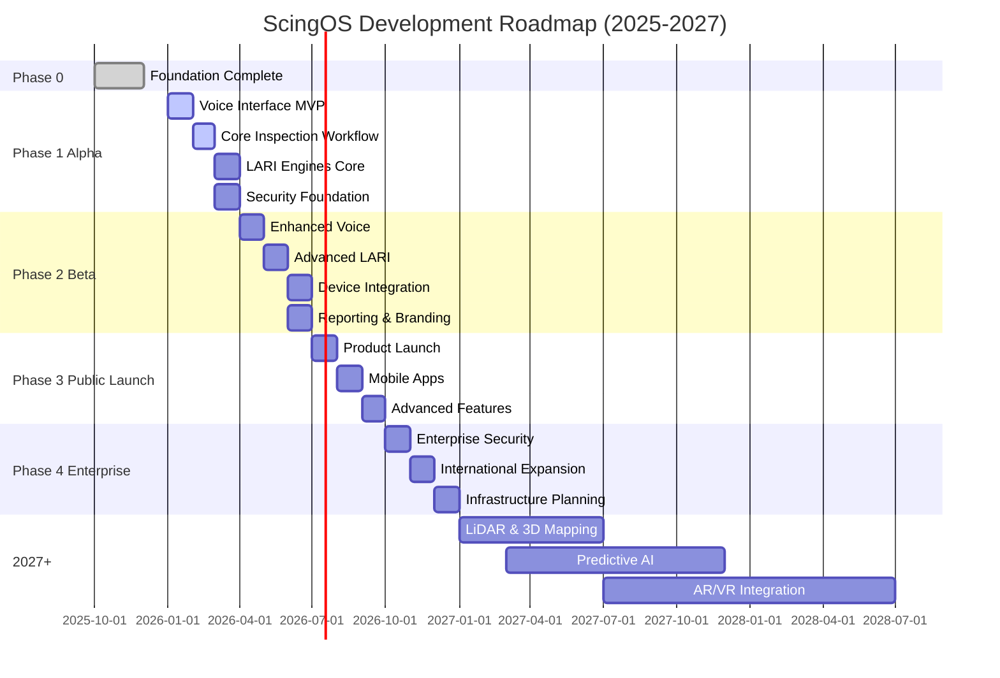

# ScingOS Product Roadmap

**Strategic Development Timeline & Vision (2025-2027+)**

---

## Table of Contents

1. [Vision Statement](#vision-statement)
2. [Current Status](#current-status)
3. [Phase 1: Alpha (Q1 2026)](#phase-1-alpha-q1-2026)
4. [Phase 2: Beta (Q2 2026)](#phase-2-beta-q2-2026)
5. [Phase 3: Public Launch (Q3 2026)](#phase-3-public-launch-q3-2026)
6. [Phase 4: Enterprise Scale (Q4 2026)](#phase-4-enterprise-scale-q4-2026)
7. [2027 and Beyond](#2027-and-beyond)
8. [Research & Innovation](#research--innovation)
9. [Success Metrics](#success-metrics)
10. [Community Roadmap](#community-roadmap)
11. [Risk Assessment](#risk-assessment)

---

## Vision Statement

### Long-Term Goals (2025-2027+)

**ScingOS** will become the premier voice-first, Bona Fide Intelligence gateway for inspection and compliance workflows, expanding to general operations management, field services, and beyond. By 2027, ScingOS will power touchless, AI-augmented workflows for thousands of professionals across multiple industries.

**Core Vision Elements:**

1. **Universal Access**: ScingOS available on every device (web, desktop, mobile, tablet, AR/VR)
2. **Industry Leadership**: The standard platform for AI-assisted inspections
3. **Technological Innovation**: Cutting-edge AI, 3D mapping, and voice interfaces
4. **Global Reach**: Multi-language, multi-jurisdiction support worldwide
5. **Trusted Partner**: Known for security, privacy, and Bona Fide Intelligence principles

**Expansion Vision:**

- **2025-2026**: Dominate inspection industry
- **2027**: Expand to facilities management, field services
- **2028+**: General-purpose operational intelligence platform

---

## Current Status

### Version 0.1.0 Alpha

**Release Date**: December 2025  
**Status**: In Development (Phase 1 Alpha)

#### Completed Phase 0 Achievements ✅

**Foundation Complete (Q4 2025):**

1. **Architecture & Design**
   - ✅ Three-layer architecture defined (Cloud, Protocol, Client)
   - ✅ AIP protocol specification complete
   - ✅ Component designs for SCING, LARI, BANE

2. **Repository & Infrastructure**
   - ✅ GitHub repository established and organized
   - ✅ CI/CD pipeline with GitHub Actions
   - ✅ Development environment setup
   - ✅ Code quality tools (ESLint, Prettier, Commitlint)

3. **Documentation**
   - ✅ Comprehensive architecture documentation
   - ✅ BFI philosophy defined
   - ✅ API specifications drafted
   - ✅ Contributing guidelines established

4. **Technology Stack Selection**
   - ✅ Frontend: Next.js 14, React 18, TypeScript
   - ✅ Backend: Firebase (Auth, Firestore, Functions, Storage)
   - ✅ AI: Google Cloud AI (Gemini models)
   - ✅ 3D: React Three Fiber, Three.js
   - ✅ Desktop: Tauri framework

5. **Security Framework**
   - ✅ BANE architecture designed
   - ✅ Zero-trust model defined
   - ✅ Security Decision Records (SDR) specification
   - ✅ Capability-based authorization model

#### Phase 1 Alpha - In Progress 🔄

**Current Completion: ~65%**

**Completed:**

- ✅ Firebase integration (Auth, Firestore, Storage, Functions)
- ✅ Basic web client (Next.js app)
- ✅ Neural 3D environment prototype (React Three Fiber)
- ✅ Mock neural state system
- ✅ AIP protocol foundation
- ✅ BANE security framework implementation started
- ✅ ISDC Protocol 2025 (inspection data communication)

**In Progress (40-80% complete):**

- 🔄 SCING voice interface (70% complete)
  - Wake word detection integration in progress
  - STT/TTS integration ongoing
  - NLP pipeline under development
- 🔄 LARI engine suite (65% complete)
  - LARI-Language: Code intelligence foundation built
  - LARI-Vision: Gemini integration ongoing
  - LARI-Reasoning: Basic workflow logic implemented
  - LARI-Narrator: Report templates in development
- 🔄 Device adapter framework (40% complete)
  - Base adapter architecture defined
  - Bluetooth/USB discovery implemented
  - First adapters in development

- 🔄 Report generation system (50% complete)
  - PDF export functional
  - Template system in progress
  - Natural language generation testing

**Upcoming (0-40% complete):**

- ⏳ Desktop app (Tauri) - packaging in progress (30%)
- ⏳ Advanced security features - BANE policies implementation (25%)
- ⏳ Performance optimization - initial profiling done (20%)
- ⏳ Comprehensive testing - test infrastructure setup (35%)

---

## Phase 1: Alpha (Q1 2026)

**Timeline**: January - March 2026  
**Goal**: Functional prototype with core voice interface and inspection workflow  
**Target Users**: Internal testing + 5-10 pilot inspectors

### Milestones

#### M1.1: Voice Interface MVP (January 2026)

**Objective**: Functional voice interaction with Scing

**Deliverables:**

- Wake word detection ("Hey, Scing!") using Picovoice Porcupine
- Speech-to-text integration (OpenAI Whisper or Google Cloud STT)
- Text-to-speech with natural voice (ElevenLabs or Google Cloud TTS)
- Basic voice command processing (10-15 core commands)
- Session state management across conversation turns
- Visual feedback in Neural 3D environment

**Technical Challenges:**

- Low-latency voice processing (<500ms response time)
- Noise cancellation in field environments
- Continuous listening with low power consumption
- Context management across multi-turn dialogues

**Success Criteria:**

- ✅ 95% wake word detection accuracy
- ✅ 90% voice command recognition accuracy
- ✅ <1 second end-to-end voice command latency
- ✅ 10+ hours continuous operation on battery (desktop)

**Dependencies:**

- Firebase authentication functional
- AIP protocol WebSocket connection stable
- Neural 3D environment rendering smoothly

#### M1.2: Core Inspection Workflow (February 2026)

**Objective**: Complete a basic inspection from start to finish via voice

**Deliverables:**

- Inspection session creation and management
- Voice-driven finding capture ("Note a crack in the foundation wall")
- Photo/video capture integration with device camera
- Basic code lookup (ICC, NFPA, NEC) via LARI-Language
- Simple report generation with findings list
- Report export (PDF)

**Technical Challenges:**

- Media capture and upload optimization
- Real-time code database search
- Report template flexibility
- State synchronization across devices

**Success Criteria:**

- ✅ Complete residential inspection in 45 minutes (vs. 60 minutes manual)
- ✅ Generate professional PDF report in <2 minutes
- ✅ Code lookup success rate >85%
- ✅ User satisfaction score >7/10

**Dependencies:**

- Firestore schema finalized for inspections
- Cloud Storage configured for media
- LARI-Language engine operational
- LARI-Narrator basic templates ready

#### M1.3: LARI AI Engines - Core Functions (March 2026)

**Objective**: Essential AI capabilities operational

**Deliverables:**

1. **LARI-Language**
   - ICC, NFPA, NEC, OSHA code databases indexed
   - Semantic search with embeddings
   - Multi-jurisdictional code lookup
   - Citation generation

2. **LARI-Vision**
   - Gemini 1.5 Flash integration
   - Basic defect detection (cracks, water damage, mold)
   - Thermal image analysis
   - Confidence scoring

3. **LARI-Reasoning**
   - Workflow orchestration logic
   - Basic risk scoring (1-10 scale)
   - Finding prioritization
   - Compliance checking

4. **LARI-Narrator**
   - Report template system
   - Natural language generation
   - PDF export with branding
   - Finding summarization

**Technical Challenges:**

- Model accuracy and reliability
- Inference latency (<3 seconds per image)
- Multi-engine coordination
- Error handling and graceful degradation

**Success Criteria:**

- ✅ Code search returns relevant results >90% of time
- ✅ Vision defect detection accuracy >80%
- ✅ Risk scoring correlates with expert judgment >75%
- ✅ Generated reports require <15 minutes editing

**Dependencies:**

- Google Cloud AI account and quotas
- Firebase Cloud Functions deployment
- Code databases acquired and processed
- Training data for vision models

#### M1.4: Security & Compliance Foundation (March 2026)

**Objective**: BANE security framework operational

**Deliverables:**

- Capability-based authorization system
- Security Decision Records (SDR) logging
- WORM audit trail in Firestore
- Basic threat detection
- Data encryption (at rest and in transit)
- GDPR compliance measures (consent, data export, deletion)

**Technical Challenges:**

- Performance impact of audit logging
- SDR immutability guarantees
- Key management for signatures
- Compliance documentation

**Success Criteria:**

- ✅ All privileged actions logged
- ✅ SDR integrity verification passes 100%
- ✅ Data export requests completed <24 hours
- ✅ Security audit passes initial review

**Dependencies:**

- Firebase security rules configured
- Cloud Functions for audit logging deployed
- Legal framework documentation complete

### Phase 1 Deliverables Summary

**By End of March 2026:**

- ✅ Working voice interface (wake word, STT, TTS)
- ✅ Complete inspection workflow (voice-driven)
- ✅ 4 core LARI engines operational
- ✅ BANE security framework functional
- ✅ Web client (Next.js) deployed
- ✅ Desktop client (Tauri) beta available
- ✅ 10-20 pilot users testing actively
- ✅ Documentation comprehensive and current

**Not Included in Phase 1 (Deferred to Phase 2+):**

- ❌ Mobile apps (iOS/Android)
- ❌ Advanced 3D mapping / LiDAR
- ❌ Full Autonomy Mode
- ❌ Multi-language support
- ❌ Advanced device integrations
- ❌ Public access

---

## Phase 2: Beta (Q2 2026)

**Timeline**: April - June 2026  
**Goal**: Closed beta with 50-100 professional inspectors  
**Focus**: Refinement, performance, real-world validation

### Feature List

#### 2.1: Enhanced Voice Interface (April 2026)

**Features:**

- Multi-language support (English, Spanish to start)
- Voice authentication and speaker identification
- Advanced context management (remember previous inspections)
- Conversational shortcuts and macros
- Voice-based report editing
- Offline voice capability (limited)

**Expected Impact:**

- 20% faster inspection workflow
- Increased user adoption
- International market readiness

#### 2.2: Advanced LARI Capabilities (May 2026)

**LARI-Vision Enhancements:**

- Advanced defect detection (20+ defect types)
- 3D reconstruction from photo sets
- Infrared/thermal advanced analysis
- Comparative analysis (before/after images)
- Automatic measurement extraction

**LARI-Language Enhancements:**

- Jurisdiction auto-detection from address
- Custom code database upload (local amendments)
- Historical code version lookup
- Multi-code correlation (e.g., ICC + NFPA together)
- Natural language code explanations

**LARI-Mapper Introduction:**

- Basic LiDAR point cloud processing
- Floor plan generation (2D)
- Room detection and labeling
- Spatial annotation system
- Virtual walkthrough (basic)

**LARI-Guardian Introduction:**

- Anomaly detection across inspections
- Predictive maintenance alerts
- Safety scoring for properties
- Trend analysis and reporting

**Expected Impact:**

- 50% reduction in code lookup time
- 30% improvement in defect detection accuracy
- New 3D mapping capabilities unlocked

#### 2.3: Device Integration Expansion (June 2026)

**Supported Devices:**

- FLIR thermal cameras (5+ models)
- Leica laser distance measurers
- DJI drones (Mavic series)
- Olympus borescopes
- Generic Bluetooth moisture meters
- WiFi-enabled inspection cameras

**Features:**

- Automatic device discovery
- One-tap pairing
- Real-time data streaming to cloud
- Device firmware update support
- Multi-device simultaneous use

**Expected Impact:**

- Seamless hardware integration
- Broader user base (those with specific devices)
- Professional workflow acceleration

#### 2.4: Reporting & Branding (June 2026)

**Features:**

- Custom report templates (user-defined)
- Company branding (logos, colors, headers/footers)
- Multi-format export (PDF, DOCX, HTML)
- Interactive web reports
- Report signing and verification (cryptographic)
- Client portal for report delivery
- Automated email delivery

**Expected Impact:**

- Professional, branded deliverables
- Client satisfaction increase
- Competitive differentiation

### Performance Goals

**Target Metrics by End of Q2 2026:**

| Metric                    | Current (Q1) | Target (Q2) | Improvement |
| ------------------------- | ------------ | ----------- | ----------- |
| Voice command latency     | 800ms        | 400ms       | 50% faster  |
| Image analysis time       | 5s           | 2s          | 60% faster  |
| Report generation time    | 15min        | 5min        | 67% faster  |
| Code lookup accuracy      | 85%          | 92%         | +7%         |
| Defect detection accuracy | 80%          | 88%         | +8%         |
| User satisfaction         | 7.2/10       | 8.5/10      | +1.3        |
| System uptime             | 95%          | 99.5%       | +4.5%       |

### Success Criteria for Beta Launch

**Must Have:**

- ✅ 50+ active beta users
- ✅ 500+ inspections completed
- ✅ <5% critical bug rate
- ✅ 8.0+ average user satisfaction
- ✅ 99%+ uptime
- ✅ SOC 2 Type I compliance achieved
- ✅ All Phase 1 features stable

**Nice to Have:**

- ⭐ 100+ active beta users
- ⭐ 80% user retention month-over-month
- ⭐ Positive press coverage
- ⭐ Partnership announcements (hardware vendors)

---

## Phase 3: Public Launch (Q3 2026)

**Timeline**: July - September 2026  
**Goal**: Public availability with subscription model  
**Target**: 500+ paying users by end of Q3

### Go-to-Market Strategy

#### 3.1: Product Launch (July 2026)

**Launch Channels:**

- Product Hunt launch
- Industry conference presence (ASHI, InterNACHI)
- Press releases to industry publications
- Social media campaign
- Email marketing to waitlist
- Referral program (beta users invite peers)

**Launch Offers:**

- Early adopter discount (20% off first year)
- Lifetime "Founder" tier for first 100 paid users
- Free tier with limited features
- 30-day trial for all paid tiers

**Launch Content:**

- Product demo videos
- Case studies from beta users
- Webinar series on AI-assisted inspections
- Blog post series on BFI philosophy
- Documentation hub (public wiki)

#### 3.2: Pricing Tiers (July 2026)

**Free Tier - "Starter"**

- $0/month
- 10 inspections/month
- Basic voice interface
- Core LARI engines (limited)
- Standard report templates
- Community support

**Professional Tier - "Pro"**

- $49/month (or $470/year)
- Unlimited inspections
- Full voice interface
- All LARI engines (full access)
- Custom report templates
- Branding customization
- Device integrations (5 devices)
- Email support
- 10GB cloud storage

**Business Tier - "Business"**

- $99/month (or $950/year)
- Everything in Pro, plus:
- Team collaboration (up to 5 users)
- Advanced analytics
- Priority support
- 50GB cloud storage
- API access
- Custom integrations

**Enterprise Tier - "Enterprise"**

- Custom pricing
- Everything in Business, plus:
- Unlimited users
- Dedicated account manager
- SLA guarantees (99.9% uptime)
- Custom deployment options
- On-premise option (2027)
- White-label options
- Unlimited storage
- 24/7 phone support

#### 3.3: Marketing Initiatives (Q3 2026)

**Content Marketing:**

- Weekly blog posts on inspection best practices
- Monthly webinars on ScingOS features
- YouTube channel with tutorials and demos
- Podcast sponsorships (inspection industry)
- Guest articles in industry publications

**Partnerships:**

- Hardware manufacturers (FLIR, Leica, DJI)
- Inspection associations (ASHI, InterNACHI)
- Training organizations
- Insurance companies
- Real estate platforms

**Community Building:**

- User forum launch
- Feature request voting
- User group meetings (virtual and in-person)
- Annual user conference planning (2027)

### Technical Features for Public Launch

#### 3.4: Mobile Applications (August 2026)

**iOS App:**

- Native Swift app
- Full feature parity with web
- Offline mode for inspections
- Siri integration ("Hey Siri, ask Scing...")
- Apple Watch companion app

**Android App:**

- Native Kotlin app
- Full feature parity with web
- Offline mode
- Google Assistant integration

**Expected Impact:**

- 3x user base expansion (mobile-first users)
- Field usability improvement
- Competitive advantage

#### 3.5: Advanced Features (September 2026)

**Full Autonomy Mode:**

- Scing can proactively take actions with permission
- Auto-capture photos when defects detected
- Auto-generate findings from observations
- Auto-update reports in real-time
- Safety guardrails and human approval gates

**Collaborative Features:**

- Multi-user inspections
- Real-time collaboration
- Shared reports and findings
- Team chat within inspections
- Review and approval workflows

**Integration Marketplace:**

- Third-party integrations
- Pre-built connectors (Zapier, etc.)
- Custom integration SDK
- Developer portal

### Success Metrics for Public Launch

**By End of Q3 2026:**

| Metric                          | Target   |
| ------------------------------- | -------- |
| Total registered users          | 2,000+   |
| Paying users                    | 500+     |
| Monthly recurring revenue (MRR) | $30,000+ |
| Inspections completed           | 5,000+   |
| User satisfaction (NPS)         | 50+      |
| Churn rate                      | <5%      |
| System uptime                   | 99.9%    |
| Support response time           | <4 hours |

---

## Phase 4: Enterprise Scale (Q4 2026)

**Timeline**: October - December 2026  
**Goal**: Enterprise-ready platform with advanced capabilities  
**Target**: 50+ enterprise customers, 2,000+ total users

### Enterprise Features

#### 4.1: Enterprise Security & Compliance (October 2026)

**Features:**

- SOC 2 Type II certification
- HIPAA compliance (for healthcare facilities inspections)
- ISO 27001 certification pursuit
- Single Sign-On (SSO) with SAML, OAuth
- Advanced role-based access control (RBAC)
- Multi-tenant architecture with data isolation
- Audit logging and compliance reporting
- Data residency options (US, EU, custom)
- Penetration testing and security audits
- Bug bounty program launch

**Expected Impact:**

- Enterprise sales enablement
- Trust and credibility increase
- Regulatory compliance achievement

#### 4.2: International Expansion (November 2026)

**Features:**

- Multi-language support (10+ languages)
- Multi-jurisdiction code databases:
  - UK Building Regulations
  - Australian Building Code
  - Canadian Building Code
  - European standards (EN, DIN, etc.)
- Currency support (invoicing in local currency)
- Regional data centers (US, EU, APAC)
- Localized support teams

**Expected Impact:**

- International market access
- Revenue diversification
- Global brand establishment

#### 4.3: Infrastructure Migration Path (December 2026)

**Planning for Owned Infrastructure:**

**Phase 4a: Hybrid Model (Q4 2026)**

- Cloud AI processing continues
- Data storage migrates to owned infrastructure
- Private interconnect setup
- Cost-benefit analysis

**Phase 4b: Gradual Migration (2027)**

- Kubernetes cluster setup
- Database migration to self-hosted
- AI model hosting on owned GPUs
- Gradual customer migration

**Phase 4c: Full Migration (2028+)**

- All services on owned infrastructure
- Cloud as backup/disaster recovery only
- Cost savings realized
- Full data control

**Expected Impact:**

- Long-term cost reduction (30-50%)
- Data sovereignty for enterprise clients
- Competitive pricing advantage

### Advanced AI Capabilities

#### 4.4: Predictive Intelligence (Q4 2026)

**Features:**

- Predictive maintenance forecasting
- Seasonal defect pattern recognition
- Risk prediction based on historical data
- Automated inspection scheduling
- Proactive client notifications
- Market trend analysis for inspectors

**Models:**

- Time-series forecasting for maintenance
- Classification models for risk levels
- Clustering for property segmentation
- Anomaly detection for unusual issues

**Expected Impact:**

- Move from reactive to proactive inspections
- Client value proposition enhancement
- Recurring revenue opportunities (monitoring services)

### Success Metrics for Q4 2026

**By End of 2026:**

| Metric                         | Target        |
| ------------------------------ | ------------- |
| Total users                    | 5,000+        |
| Enterprise customers           | 50+           |
| Annual recurring revenue (ARR) | $500,000+     |
| Inspections completed          | 25,000+       |
| Countries served               | 10+           |
| Team size                      | 15+ employees |
| System uptime                  | 99.95%        |
| Customer retention             | 90%+          |

---

## 2027 and Beyond

### LiDAR & 3D Mapping Advancement (2027)

**Features:**

- Advanced point cloud processing
- Real-time 3D reconstruction
- Automated BIM model generation
- Virtual reality (VR) walkthrough
- Augmented reality (AR) on-site annotation
- Integration with CAD software
- 3D defect mapping in space
- Automated measurement extraction

**Hardware Partnerships:**

- LiDAR scanner manufacturers
- VR headset integration (Meta Quest, Apple Vision Pro)
- AR glasses integration (future)

**Expected Impact:**

- New market segment (3D documentation services)
- Premium pricing for advanced features
- Competitive moat (technical complexity)

### AI-Powered Predictive Insights (2027-2028)

**Capabilities:**

- Predict property issues before they occur
- Maintenance optimization recommendations
- Insurance risk assessment
- Property value impact analysis
- Climate change impact modeling
- Energy efficiency optimization

**Business Models:**

- Subscription monitoring services
- Insurance partnerships (risk assessment)
- Property management tool integration
- Energy auditing services

### Industry Expansion (2028+)

**Target Industries:**

- Facilities management
- Construction site monitoring
- Manufacturing quality control
- Healthcare facility compliance
- Hospitality property management
- Government infrastructure inspections
- Environmental assessment
- Archaeological site documentation

**Expected Impact:**

- 10x market expansion
- Multi-industry platform
- Platform effect and network value

### AR/VR Integration (2028+)

**Vision:**

- Full AR on-site experience
- Virtual training environments
- Remote inspection collaboration
- 3D annotation in spatial context
- Hands-free AR glasses operation
- Spatial computing integration

**Technologies:**

- Apple Vision Pro integration
- Meta Quest enterprise
- HoloLens for enterprise
- Future AR glasses (Google, etc.)

---

## Research & Innovation

### Experimental Features

**Voice AI Advancement:**

- Emotion detection in voice
- Multi-speaker identification
- Real-time translation
- Accent and dialect handling

**Computer Vision:**

- Video analysis (not just images)
- Real-time defect detection (live camera)
- Automated photo composition suggestions
- Light-field imaging analysis

**Natural Language Processing:**

- Legal document analysis
- Contract review automation
- Automated code interpretation
- Conversational report generation

### Technology Investigations

**Blockchain for Verification:**

- Immutable inspection records
- NFT-based report certification
- Decentralized audit trails

**Edge AI:**

- On-device AI inference
- Reduced cloud dependency
- Privacy enhancement
- Offline full functionality

**Quantum-Resistant Cryptography:**

- Future-proof security
- Post-quantum encryption
- Long-term data protection

### Academic Partnerships

**Research Collaborations:**

- University AI labs for algorithm development
- Building science departments for domain expertise
- Ethics research for BFI advancement
- Human-computer interaction studies

**Internship Programs:**

- Co-op programs with universities
- Summer research internships
- Thesis and capstone projects

---

## Success Metrics

### KPI Targets by Quarter

**Q1 2026 (Alpha):**

- Users: 10-20 (pilot)
- Inspections: 100+
- System uptime: 95%
- User satisfaction: 7.0+

**Q2 2026 (Beta):**

- Users: 100+
- Inspections: 1,000+
- System uptime: 99%
- User satisfaction: 8.0+
- MRR: $5,000

**Q3 2026 (Public Launch):**

- Users: 2,000+
- Paying users: 500+
- Inspections: 5,000+
- System uptime: 99.5%
- User satisfaction: 8.5+
- MRR: $30,000

**Q4 2026 (Enterprise):**

- Users: 5,000+
- Enterprise customers: 50+
- Inspections: 25,000+
- System uptime: 99.9%
- User satisfaction: 9.0+
- MRR: $75,000+
- ARR: $500,000+

### User Growth Projections

| Quarter | Total Users | Paying Users | Revenue    |
| ------- | ----------- | ------------ | ---------- |
| Q1 2026 | 20          | 0            | $0         |
| Q2 2026 | 100         | 50           | $30,000    |
| Q3 2026 | 2,000       | 500          | $180,000   |
| Q4 2026 | 5,000       | 1,500        | $540,000   |
| Q1 2027 | 10,000      | 3,500        | $1,260,000 |
| Q2 2027 | 20,000      | 7,000        | $2,520,000 |
| Q3 2027 | 35,000      | 12,000       | $4,320,000 |
| Q4 2027 | 50,000      | 18,000       | $6,480,000 |

### Revenue Milestones

- **$10K MRR**: Q2 2026 (Beta launch)
- **$50K MRR**: Q4 2026 (Enterprise readiness)
- **$100K MRR**: Q1 2027 (Scale phase)
- **$500K MRR**: Q3 2027 (Market leadership)
- **$1M MRR**: Q1 2028 (Industry standard)

---

## Community Roadmap

### How Community Can Influence

**Feature Request Process:**

1. Submit feature request via GitHub Discussions
2. Community votes on requests
3. Top-voted requests reviewed monthly
4. Roadmap updated quarterly based on feedback
5. Implemented features attributed to requesters

**Beta Testing Program:**

- Early access to new features
- Provide feedback and bug reports
- Influence feature design
- Recognition in release notes

**Open Source Contributions:**

- Device adapter framework (open source)
- Report templates (community-contributed)
- Code database contributions (jurisdictional)
- Documentation improvements

### Community Events

**2026:**

- Quarterly virtual meetups
- Beta user summit (Q2)
- Public launch event (Q3)
- End-of-year community awards

**2027+:**

- Annual user conference
- Regional workshops
- Certification program
- Community leadership council

---

## Risk Assessment

### Technical Risks

| Risk                              | Probability | Impact   | Mitigation                                        |
| --------------------------------- | ----------- | -------- | ------------------------------------------------- |
| Voice recognition accuracy issues | Medium      | High     | Multi-provider fallback, continuous training      |
| AI model hallucinations           | Medium      | High     | Confidence thresholds, human review gates         |
| Firebase scaling limits           | Low         | Medium   | Migration path to owned infrastructure            |
| Security breach                   | Low         | Critical | SOC 2 compliance, penetration testing, bug bounty |
| Performance degradation at scale  | Medium      | High     | Early load testing, optimization pipeline         |

### Market Risks

| Risk                    | Probability | Impact   | Mitigation                                        |
| ----------------------- | ----------- | -------- | ------------------------------------------------- |
| Low user adoption       | Medium      | Critical | Extensive beta testing, user feedback integration |
| Competitor emerges      | Medium      | High     | Fast iteration, unique BFI positioning, patents   |
| Regulatory changes      | Low         | Medium   | Compliance monitoring, adaptable architecture     |
| Economic downturn       | Medium      | Medium   | Free tier offering, flexible pricing, value focus |
| Technology obsolescence | Low         | High     | R&D investment, tech trend monitoring             |

### Mitigation Strategies

**Technical:**

- Redundant systems and providers
- Comprehensive testing (unit, integration, E2E)
- Performance monitoring and alerting
- Disaster recovery planning
- Regular security audits

**Market:**

- Close user relationships and feedback loops
- Continuous value delivery
- Patent and IP protection
- Flexible business model
- Diversified revenue streams

**Operational:**

- Experienced team building
- Clear communication and documentation
- Agile development process
- Financial runway management
- Strategic partnerships

---

## Roadmap Visualization

---

## Conclusion

The ScingOS roadmap represents an ambitious but achievable vision for transforming the inspection industry through voice-first, AI-augmented intelligence. By maintaining focus on Bona Fide Intelligence principles, user-centric design, and technical excellence, ScingOS will become the premier platform for inspection professionals worldwide.

**Key Success Factors:**

1. Deliver value early and often (agile iterations)
2. Listen to users and adapt quickly
3. Maintain technical quality and security
4. Build trust through transparency
5. Foster community and ecosystem

**Next Steps:**

- Complete Phase 1 Alpha (Q1 2026)
- Launch closed beta with real users (Q2 2026)
- Prepare for public launch (Q3 2026)
- Scale to enterprise readiness (Q4 2026)

The future of inspection intelligence is voice-first, AI-augmented, and human-centered. Welcome to ScingOS.

---

**Document Version**: 1.0  
**Last Updated**: December 2025  
**Next Review**: March 2026

For questions or feedback on the roadmap, contact: isystemsdirect@gmail.com

---

_The roadmap is a living document and subject to change based on user feedback, market conditions, and technical discoveries._
